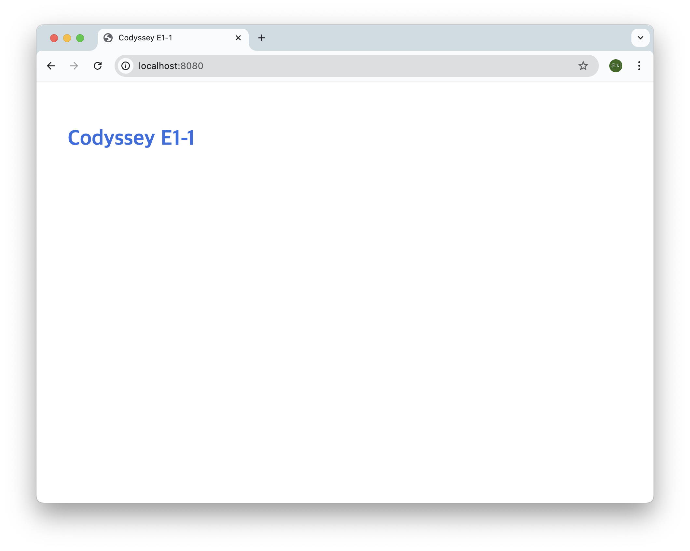
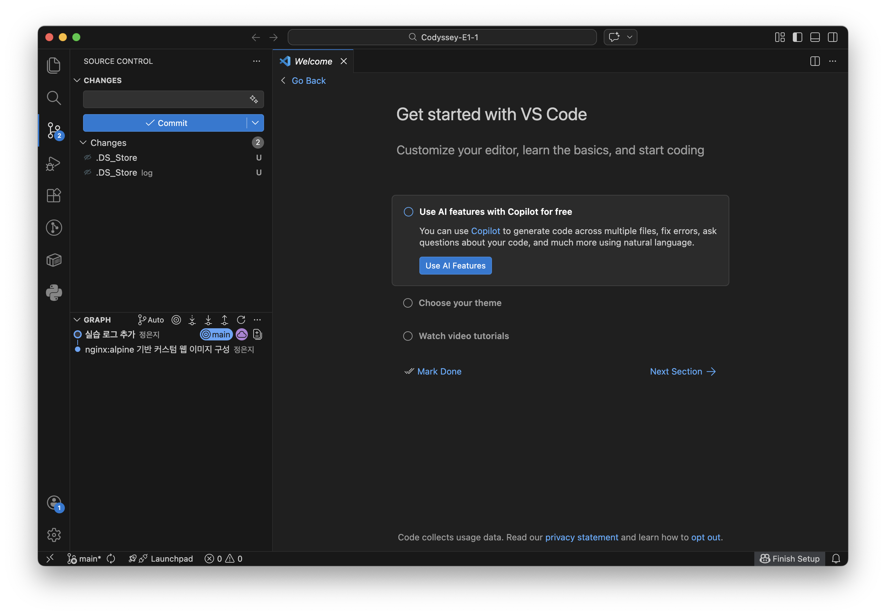

# Codyssey E1-1 내 컴퓨터에 개발자용 '작업실' 꾸미기

## 1. 프로젝트 개요

코드가 "내 컴퓨터에서만" 돌아가는 문제를 줄이기 위한 재현 가능한 개발 워크스테이션 구축

- 리눅스 CLI로 작업 디렉토리와 권한 정리
- Docker 설치·점검 및 컨테이너 실행/관리
- 웹 서버를 Dockerfile로 컨테이너화하고 포트 매핑으로 접속 확인
- 바인드 마운트로 "변경 반영", 볼륨으로 "데이터 영속성" 검증
- Git/GitHub로 버전 관리 및 원격 저장소 연동

---

## 2. 실행 환경

| 항목 | 값 |
|---|---|
| OS | macOS |
| Shell / 터미널 | zsh / macOS Terminal |
| Docker | Client 28.5.2 / Server 28.5.2 (`overlay2`) |
| Git | 2.53.0 |

---

## 3. 수행 체크리스트

- [x] 터미널 기본 조작 및 폴더 구성
- [x] 권한 변경 실습 (파일 1건 + 디렉토리 1건)
- [x] Docker 설치 및 점검 (`--version`, `info`)
- [x] `hello-world` 실행
- [x] `ubuntu` 컨테이너 내부 진입 및 명령 수행
- [x] 컨테이너 종료/유지 차이 관찰
- [x] Docker 기본 운영 명령 (`images`, `ps`, `ps -a`, `logs`, `stats`, `stop`)
- [x] Dockerfile 기반 커스텀 이미지 빌드/실행
- [x] 포트 매핑 및 브라우저 접속 확인
- [x] 바인드 마운트 반영 검증
- [x] 볼륨 영속성 검증
- [x] Git 설정 + GitHub / VSCode 연동

---

## 4. 디렉토리 구조

```
Codyssey-E1-1/
├── README.md
├── .gitignore
├── Dockerfile
├── app/                   ← 웹 서버 소스코드
│   ├── index.html
│   └── style.css
├── log/                   ← 터미널 조작 로그 (전체)
│   ├── 01_terminal.log
│   ├── 02_permission.log
│   ├── 03_docker.log
│   ├── 04_dockerfile.log
│   ├── 05_volume.log
│   └── 06_git.log
├── image/                 ← 스크린샷 증거
│   ├── 브라우저접속화면.png
│   └── 깃허브연동화면.png
└── test/                  ← 권한 실습용 파일
```

---

## 5. 터미널 기본 조작

전체 로그: [`log/01_terminal.log`](log/01_terminal.log)

### 목적
디렉토리와 파일을 CLI로 다루고, 절대 경로와 상대 경로의 차이 확인

### 위치 및 목록 확인

```bash
$ pwd
/Users/unji09070981

$ ls -al
drwxr-xr-x   5 unji09070981  unji09070981   160 Jul 29 15:57 .docker
drwxr-xr-x  10 unji09070981  unji09070981   320 Jul 29 15:57 .orbstack
...
```

`-a` 옵션으로 `.docker`, `.orbstack` 등 숨김 파일까지 표시됨

### 생성 · 복사 · 이동 · 삭제

```bash
$ cd Downloads
$ mkdir test
$ cd test
$ pwd
/Users/unji09070981/Downloads/test

$ touch test.txt
$ cat test.txt

$ vi test.txt
$ cat test.txt
codyssey

$ cp test.txt tmp.txt
$ ls -al
-rw-r--r--  1 unji09070981  unji09070981    9 Jul 29 16:28 test.txt
-rw-r--r--  1 unji09070981  unji09070981    9 Jul 29 16:29 tmp.txt

$ mkdir tmp
$ mv tmp.txt tmp/tmp1.txt
$ cd tmp
$ ls
tmp1.txt

$ cd ..
$ rm -rf tmp
$ ls
test.txt
```

### 확인
- `touch` 직후의 `cat`은 출력 없음 — 빈 파일이기 때문
- `mv` 한 번으로 이동과 이름 변경이 동시 수행

### 절대 경로 vs 상대 경로

| 구분 | 예시 | 특징 |
|---|---|---|
| 절대 경로 | `/Users/unji09070981/Downloads/test` | 루트(`/`)에서 시작. 어디에 있든 항상 같은 위치 |
| 상대 경로 | `cd ..`, `tmp/tmp1.txt` | 현재 작업 디렉토리 기준. 위치가 바뀌면 가리키는 곳도 변경 |

---

## 6. 권한 실습

전체 로그: [`log/02_permission.log`](log/02_permission.log)

### 목적
파일과 디렉토리 각각에 대해 권한을 제거했을 때 어떤 동작이 막히는지 확인

### 파일 — 읽기 권한 제거

**[변경 전]** 권한 644

```bash
$ ls -al
-rw-r--r--  1 unji09070981  unji09070981    9 Jul 29 16:28 test.txt

$ cat test.txt
codyssey
```

**[변경 후]** 권한 000

```bash
$ chmod 000 test.txt

$ ls -al
----------  1 unji09070981  unji09070981    9 Jul 29 16:28 test.txt

$ cat test.txt
cat: test.txt: Permission denied
```

### 디렉토리 — 진입 권한 제거

**[변경 전]** 권한 755

```bash
$ ls -al
drwxr-xr-x  2 unji09070981  unji09070981   64 Jul 29 16:44 tmp

$ cd tmp
$ cd ..
```

**[변경 후]** 권한 000

```bash
$ chmod 000 tmp

$ ls -al
d---------  2 unji09070981  unji09070981   64 Jul 29 16:44 tmp

$ cd tmp
cd: permission denied: tmp
```

### 확인
- 파일은 `r`이 사라지자 `cat` 차단
- 디렉토리는 `x`가 사라지자 `cd` 진입 차단
- 같은 `000`이라도 막히는 동작이 다름

### 권한 표기 해석

```
-rwxr-xr-x   →   7 5 5
 │└┬┘└┬┘└┬┘
 │ │  │  └─ other(그 외) : r-x = 4+0+1 = 5
 │ │  └──── group(그룹)  : r-x = 4+0+1 = 5
 │ └─────── user(소유자) : rwx = 4+2+1 = 7
 └───────── 타입 (- 파일 / d 디렉토리)
```

---

## 7. Docker 설치 및 점검

전체 로그: [`log/03_docker.log`](log/03_docker.log)

### 목적
Docker 클라이언트와 서버(데몬)의 정상 동작 확인

```bash
$ docker --version
Docker version 28.5.2, build ecc6942

$ docker info
Client:
 Version:    28.5.2
 Context:    orbstack
Server:
 Server Version: 28.5.2
 Storage Driver: overlay2
 Cgroup Version: 2
 Operating System: OrbStack
 OSType: linux
 CPUs: 6
 Total Memory: 15.67GiB
```

### 확인
- `Server:` 블록 출력 → 데몬 정상 동작
- `Context: orbstack`, `Operating System: OrbStack` → OrbStack이 제공하는 리눅스 VM 위에서 엔진 구동

---

## 8. 컨테이너 실행 실습

전체 로그: [`log/03_docker.log`](log/03_docker.log)

### 목적
컨테이너를 실행·중지·조회하고, 종료와 유지의 차이 확인

### 8-1. hello-world

```bash
$ docker run hello-world
Unable to find image 'hello-world:latest' locally
latest: Pulling from library/hello-world
Status: Downloaded newer image for hello-world:latest

Hello from Docker!
This message shows that your installation appears to be working correctly.
```

로컬에 이미지가 없어 자동 pull → 컨테이너 생성 → 실행까지 수행됨

### 8-2. 이미지 다운로드 및 목록

```bash
$ docker pull ubuntu:22.04
Status: Downloaded newer image for ubuntu:22.04

$ docker images
REPOSITORY    TAG       IMAGE ID       CREATED        SIZE
ubuntu        22.04     b8e6b596a324   4 weeks ago    78.1MB
hello-world   latest    e2ac70e7319a   4 months ago   10.1kB
```


### 8-3. ubuntu 컨테이너 내부 진입

```bash
$ docker run -it --name ubuntu-test ubuntu:22.04 /bin/bash
root@c66858c15955:/# ls
bin   dev  home  lib32  libx32  mnt  proc  run   srv  tmp  var
boot  etc  lib   lib64  media   opt  root  sbin  sys  usr
root@c66858c15955:/# echo "test"
test
root@c66858c15955:/# exit
```

프롬프트가 `root@c66858c15955:/#`로 변경되고 `ls` 결과가 리눅스 루트 구조 → 호스트가 아닌 컨테이너 내부임을 확인

### 8-4. 컨테이너 종료 / 유지 차이

`-it`로 진입해 `exit`한 뒤 목록 확인 — 실행 중 목록은 비어 있고 전체 목록에만 존재

```bash
$ docker ps
CONTAINER ID   IMAGE     COMMAND   CREATED   STATUS    PORTS     NAMES

$ docker ps -a
CONTAINER ID   IMAGE          COMMAND       STATUS                     NAMES
c66858c15955   ubuntu:22.04   "/bin/bash"   Exited (0) 6 seconds ago   ubuntu-test
22c5d1cfad90   hello-world    "/hello"      Exited (0) 2 minutes ago   competent_ptolemy
```

같은 이미지를 `-dit`로 실행하면 유지됨

```bash
$ docker run -dit --name ubuntu-test2 ubuntu:22.04
a71e4dffa43138f4eff24bf1671ca791b8075f5af2d6ddb188de03ac75f913a3

$ docker ps
CONTAINER ID   IMAGE          COMMAND       STATUS         NAMES
a71e4dffa431   ubuntu:22.04   "/bin/bash"   Up 3 seconds   ubuntu-test2
```

### 확인
- 컨테이너는 메인 프로세스가 살아 있는 동안만 존재
- `-it` 진입 후 `exit` → PID 1인 bash 종료 → 컨테이너도 함께 정지
- `-dit`는 `-i`가 표준입력을 유지해 bash가 대기 상태로 잔존
- `docker ps`는 실행 중인 것만, `docker ps -a`는 종료된 것까지 표시

### 8-5. 운영 명령

```bash
$ docker logs ubuntu-test
root@c66858c15955:/# echo "test"
test
root@c66858c15955:/# exit

$ docker stats --no-stream
CONTAINER ID   NAME           CPU %   MEM USAGE / LIMIT     MEM %   PIDS
a71e4dffa431   ubuntu-test2   0.00%   3.625MiB / 15.67GiB   0.02%   1

$ docker stop ubuntu-test2
ubuntu-test2

$ docker ps
CONTAINER ID   IMAGE     COMMAND   CREATED   STATUS    PORTS     NAMES
```

### 확인
- 컨테이너 내부에서 친 명령이 `docker logs`에 그대로 잔존 → 표준출력이 로그로 수집됨
- `docker stats`는 실행 중인 컨테이너만 집계

---

## 9. 커스텀 이미지 (Dockerfile)

전체 로그: [`log/04_dockerfile.log`](log/04_dockerfile.log)

### 9-1. 선택한 기존 베이스

**`nginx:alpine`** 선택

- `FROM` 한 줄로 "nginx가 80번 포트에서 대기 중인 리눅스" 확보
- `alpine` 기반이라 이미지가 작음


### 9-2. Dockerfile

```dockerfile
FROM nginx:alpine
LABEL org.opencontainers.image.title="codyssey-E1-1-web"
LABEL org.opencontainers.image.version="1.0"
ENV APP_ENV=dev
COPY app/ /usr/share/nginx/html/
HEALTHCHECK --interval=30s --timeout=3s --retries=3 \
  CMD wget -qO- http://localhost/ || exit 1
EXPOSE 80
```

### 9-3. 커스텀 포인트별 목적

| 커스텀 포인트 | 목적 |
|---|---|
| `LABEL ...title` / `...version` | 이미지 메타데이터. 무슨 이미지의 몇 버전인지 식별. |
| `ENV APP_ENV=dev` | 실행 모드를 코드가 아닌 환경 변수로 분리. `-e APP_ENV=production`으로 덮어쓰기 가능 |
| `COPY app/ /usr/share/nginx/html/` | nginx 기본 페이지를 직접 작성한 `index.html`·`style.css`로 교체 |
| `HEALTHCHECK` | 응답하는지를 30초 주기로 검사 |
| `EXPOSE 80` | 이미지가 사용하는 포트 선언. 실제 개방은 `-p`가 담당 |

### 9-4. 빌드

```bash
$ docker build -t web-test:1.0 .
[+] Building 4.5s (7/7) FINISHED                                docker:orbstack
 => [1/2] FROM docker.io/library/nginx:alpine@sha256:4a73073bd557c65b7595  2.8s
 => [2/2] COPY app/ /usr/share/nginx/html/                                 0.2s
 => exporting to image                                                     0.2s
 => => naming to docker.io/library/web-test:1.0                            0.0s

$ docker images | grep web-test
web-test      1.0       4e2d2aea74e5   6 seconds ago   62.4MB
```

`[2/2] COPY app/ /usr/share/nginx/html/`이 커스텀 레이어가 쌓인 지점

### 9-5. 실행

```bash
$ docker run -d -p 8080:80 --name web-8080 web-test:1.0
4cbfcf22c21c061972c96e186a583d9cb11fe70d5c2655ffb35e7157f5b1ed13

$ curl http://localhost:8080
<!DOCTYPE html>
...
  <h1>Codyssey E1-1</h1>
...

$ docker ps
CONTAINER ID   IMAGE          STATUS                   PORTS                    NAMES
4cbfcf22c21c   web-test:1.0   Up 3 minutes (healthy)   0.0.0.0:8080->80/tcp     web-8080
```

### 확인
- `curl` 응답이 nginx 기본 페이지가 아닌 직접 작성한 HTML → `COPY` 커스텀 적용
- `STATUS`의 `(healthy)` → HEALTHCHECK 통과
- `PORTS`의 `0.0.0.0:8080->80/tcp` → 포트 매핑 적용

---

## 10. 포트 매핑 및 접속 증거

### 목적
컨테이너 내부 80번 포트를 호스트 8080번으로 연결해 브라우저 접근 가능 여부 확인

```bash
$ docker run -d -p 8080:80 --name web-8080 web-test:1.0

$ docker ps
CONTAINER ID   IMAGE          STATUS                   PORTS                    NAMES
4cbfcf22c21c   web-test:1.0   Up 3 minutes (healthy)   0.0.0.0:8080->80/tcp     web-8080

$ curl http://localhost:8080
  <h1>Codyssey E1-1</h1>
```

### 브라우저 접속 결과



### 확인
- 주소창의 `localhost:8080`과 페이지 내용이 함께 표시됨
- `docker ps`의 `0.0.0.0:8080->80/tcp` → 호스트 8080과 컨테이너 80이 연결된 상태

---

## 11. 바인드 마운트 반영 검증

전체 로그: [`log/05_volume.log`](log/05_volume.log)

### 목적
호스트 파일을 수정했을 때 이미지 재빌드 없이 반영되는지 확인

```bash
$ docker run -d -p 8082:80 \
  -v "$(pwd)/app":/usr/share/nginx/html:ro \
  --name web-bind web-test:1.0
291b5e0afaf660cef45c8e99d7288492a7f59e03142dfad6744c38d62b478ea0
```

`:ro`(read-only)를 걸어 컨테이너가 호스트 소스를 수정하지 못하도록 설정

### [변경 전]

```bash
$ curl http://localhost:8082
<!DOCTYPE html>
<html lang="ko">
<head>
  <meta charset="UTF-8">
  <title>Codyssey E1-1</title>
  <link rel="stylesheet" href="style.css">
</head>
<body>
  <h1>Codyssey E1-1</h1>
</body>
</html>
```

### 호스트 파일 수정

```bash
$ sed -i '' 's/Codyssey E1-1/Codyssey E1-1 edited on host/' app/index.html
```

### [변경 후]

```bash
$ curl http://localhost:8082
<!DOCTYPE html>
<html lang="ko">
<head>
  <meta charset="UTF-8">
  <title>Codyssey E1-1 edited on host</title>
  <link rel="stylesheet" href="style.css">
</head>
<body>
  <h1>Codyssey E1-1 edited on host</h1>
</body>
</html>
```

### 정리

```bash
$ docker rm -f web-bind
$ sed -i '' 's/Codyssey E1-1 edited on host/Codyssey E1-1/' app/index.html
```

### 확인
- 두 `curl` 사이에 실행한 명령은 호스트 파일을 수정한 `sed` 한 줄뿐
- `docker build`·`docker restart` 없이 응답 변경 → 즉시 반영 확인

---

## 12. 볼륨 영속성 검증

전체 로그: [`log/05_volume.log`](log/05_volume.log)

### 목적
컨테이너를 삭제해도 볼륨에 저장한 데이터가 유지되는지 확인

### 12-1. 볼륨 생성

```bash
$ docker volume create data-test
data-test

$ docker volume ls
DRIVER    VOLUME NAME
local     data-test

$ docker volume inspect data-test
        "Mountpoint": "/var/lib/docker/volumes/data-test/_data",
        "Name": "data-test",
```

### 12-2. 컨테이너에 연결

```bash
$ docker run -dit --name volume-test -v data-test:/data ubuntu:22.04 /bin/bash
c027f03d8adc42193cacc9b3095b97817d8399e7d526ff7d2c518b8ac7198c7d

$ docker exec volume-test ls -ld /data
drwxr-xr-x 1 root root 0 Jul 29 10:33 /data

$ docker inspect volume-test --format '{{json .Mounts}}'
[{"Type":"volume","Name":"data-test","Source":"/var/lib/docker/volumes/data-test/_data","Destination":"/data","RW":true}]
```

`-v` 옵션만으로 컨테이너 안에 `/data` 생성. `inspect`에 볼륨 연결이 명시적으로 표시됨

### 12-3. [삭제 전]

```bash
$ docker exec volume-test bash -c "echo 'test' > /data/test.txt"
$ docker exec volume-test cat /data/test.txt
test

$ docker ps
CONTAINER ID   IMAGE          COMMAND       STATUS          NAMES
c027f03d8adc   ubuntu:22.04   "/bin/bash"   Up 34 seconds   volume-test
```

### 12-4. 컨테이너 삭제

```bash
$ docker rm -f volume-test
volume-test

$ docker ps -a
CONTAINER ID   IMAGE     COMMAND   CREATED   STATUS    PORTS     NAMES

$ docker volume ls
DRIVER    VOLUME NAME
local     data-test
```

컨테이너는 목록에서 삭제되었으나 볼륨 `data-test`는 잔존

### 12-5. [삭제 후]

```bash
$ docker run -dit --name volume-test2 -v data-test:/data ubuntu:22.04 /bin/bash
a2148672b64ef5c36e7450db21dfd99ce2374618c8daa0ac04ab83278bf6b728

$ docker exec volume-test2 cat /data/test.txt
test
```

### 확인
- 컨테이너를 완전히 삭제한 뒤 새 컨테이너에서도 이전 데이터 `test`를 그대로 읽음
- 12-4에서 `docker ps -a`는 비었으나 `docker volume ls`에는 볼륨 잔존 → 컨테이너와 볼륨의 독립성 확인

### 바인드 마운트 vs 볼륨

| 구분 | 바인드 마운트 | 볼륨 |
|---|---|---|
| 경로 지정 | 호스트 경로를 직접 지정 | Docker가 관리 (`/var/lib/docker/volumes/`) |
| 주 용도 | 개발 중 소스 즉시 반영 | 운영 데이터 영속성 |
| 환경 종속성 | 호스트 경로에 종속 | 환경 독립적 |

---

## 13. Git 설정 및 GitHub / VSCode 연동

전체 로그: [`log/06_git.log`](log/06_git.log)

### 목적
Git 사용자 정보와 기본 브랜치를 설정하고 GitHub 원격 저장소 연동 확인

### 13-1. Git 설정


```bash
$ git --version
git version 2.53.0

$ git config --list
user.name=정은지
user.email=****@naver.com
init.defaultbranch=main
remote.origin.url=https://github.com/unji09/Codyssey-E1-1.git
branch.main.remote=origin
branch.main.merge=refs/heads/main
```

### 13-2. VSCode GitHub 연동



### 확인
- `branch.main.remote=origin`, `branch.main.merge=refs/heads/main` → 로컬 `main`이 원격 `main`을 추적
- VSCode Source Control 패널에서 커밋 이력·`main` 브랜치·GitHub 로그인 상태 확인

### 보안 조치

- `.gitignore`에 `.DS_Store`, `.env`, `*.pem`, `*.key` 등록
- 본 문서의 `git config --list` 출력에서 이메일 주소 마스킹
- 토큰·비밀번호·개인키는 로그·스크린샷에 미포함

---

## 14. 트러블슈팅

### 1. 컨테이너 이름 중복 충돌

| 단계 | 내용 |
|---|---|
| **문제** | `docker run -dit --name ubuntu-test ubuntu:22.04` 실행 시 `Conflict. The container name "/ubuntu-test" is already in use` |
| **원인 가설** | 앞서 종료한 동명의 컨테이너가 `Exited` 상태로 남아 이름을 점유 중인 것으로 추정 |
| **확인** | `docker ps -a` → `ubuntu-test`가 `Exited (0)` 상태로 존재. `docker ps`에는 미표시되나 이름은 점유 중 |
| **해결** | 컨테이너 이름은 실행 여부와 무관하게 유일해야 하므로 `ubuntu-test2`라는 새 이름으로 실행 |

### 2. 볼륨 미연결 상태에서 경로 접근 실패

| 단계 | 내용 |
|---|---|
| **문제** | `docker exec volume-test bash -c "echo 'test' > /data/test.txt"` 실행 시 `/data/test.txt: No such file or directory` |
| **원인 가설** | `-v` 옵션 없이 컨테이너를 생성해 `/data`가 미생성된 것으로 추정 |
| **확인** | `docker inspect volume-test --format '{{json .Mounts}}'` → `[]` (마운트 없음) |
| **해결** | 볼륨 연결은 컨테이너 생성 시점에만 지정 가능하므로, `docker rm -f`로 삭제 후 `-v data-test:/data`를 포함해 재생성 |
